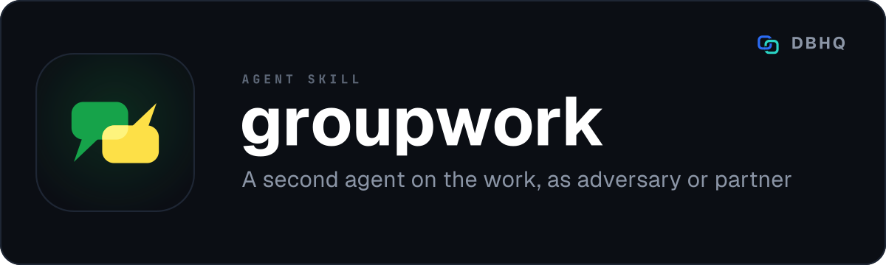

<div align="center">



# groupwork

**Blind, independent review by a second model, with a record you can cite**

[](LICENSE)
[](https://code.claude.com/docs/en/plugins)
[]()

A free, open-source tool by [DBHQ](https://dbhq.uk) - documented at [skills.dbhq.uk](https://skills.dbhq.uk/groupwork/)

</div>

---

Blind, independent review by a second model, before something ships, with a
citation of what it was not shown. Not a place to think out loud with a peer who
can see your view: use a persistent advisor session for that.

## What makes it different

Four named patterns for using a second AI agent, running on Codex or opencode
behind one provider layer.

The patterns are the product. The reason this is not a wrapper around
`codex exec` is the **withholding rule**: a second opinion that has already been
told your conclusion is not a second opinion, it is agreement with extra steps.

Every pattern refuses to carry your view at all, and the refusal is enforced in
code rather than requested in prose. For thinking out loud with a peer who sees
your view, use a persistent advisor session instead.

| Pattern | Use it when | It is not told |
|---|---|---|
| `red-team` | You want the idea killed if it deserves killing | Your evidence, and by default the repository itself |
| `second-opinion` | You have a view and want one reached without it | Your conclusion, draft or findings |
| `verify` | Work is finished and about to ship | Whether anyone thinks it passes |
| `panel` | A hard call where the trade-off is the answer | Your view, and each other's answers |

## Install

### As a Claude Code plugin (recommended)

```
/plugin marketplace add dbhq-uk/marketplace
/plugin install groupwork@dbhq
```

### Any agent (Cursor, Copilot, Windsurf, Gemini, Cline and more)

```bash
npx skills add dbhq-uk/groupwork-skill
```

The [skills.sh](https://skills.sh) CLI installs into whichever agent directories
it finds, so this works outside Claude Code and Codex too.

### Local install (Claude Code or Codex)

```bash
git clone https://github.com/dbhq-uk/groupwork-skill.git
cd groupwork-skill
./install.sh          # Claude Code: symlinks into ~/.claude/skills (edits are live)
./install-codex.sh    # Codex: installs into ~/.codex/skills
```

[`install.sh`](install.sh) and [`install-codex.sh`](install-codex.sh) are the
same install two ways: Claude Code substitutes `${CLAUDE_SKILL_DIR}`, so the
whole skill directory is symlinked untouched, while Codex does not, so its
`SKILL.md` is rewritten at install time. Re-run the Codex one after editing
`SKILL.md`.

## Requirements

Python 3.9 or newer, standard library only. At least one provider CLI installed
**and authenticated** - that is the real barrier to entry, not the install.

State lives in `~/.dbhq/groupwork/` (mode 700): the brief, the raw output and
the log of each run, and `runs.jsonl`, which gets a line when a run starts and
another when it ends, whether it worked, failed, timed out or was stopped. The
file is only ever appended to. `config.json` there, if you create one, holds a
standing choice of model per provider. No credentials are stored; every
provider authenticates itself.

## Why the withholding matters

Research write-ups routinely carry a line like *"given the keyword data but none
of the community evidence, so its conclusions are independent of the
retrieval"*. A reader's only reason to trust that finding is the claim that the
reviewer really was starved of the material - and that claim is almost always
written afterwards, from memory, by the person who ran it.

groupwork writes the record at the moment of the run, from the pattern
definition. Nobody types the independence claim, so nobody can type one that is
not true.

```
**Red team:** `gpt-6-astra` via codex (codex-cli 0.154.0), 2026-09-17,
read-only, no repository access. Run `20260917T165202Z-a037c3`, withheld: our
evidence and our retrieval - it is told the claim, not where we looked. Leak
check passed: the draft conclusion was not found in the brief. Brief sha256
`9f86d081884c7d659a2feaa0c55ad015a3bf4f1b2b0b822cd15d6c15b0f00a08`.
```

The brief each run was sent is kept beside its output, so the hash in the
citation can be checked against it later.

## Use

```bash
# which counterparts are installed AND authenticated - not the same thing
python3 scripts/groupwork.py providers

# attack an idea, without showing it where you looked. --background prints a
# run id at once and the run carries on detached; status and result poll it
python3 scripts/groupwork.py run red-team --background \
  --subject "a CLI that posts physical letters, priced per letter" \
  --context "UK only. Signed For and Tracked. No subscription." \
  --no-prior-view
python3 scripts/groupwork.py status 20260925T101500Z-a1b2c3   # running, done or failed
python3 scripts/groupwork.py result 20260925T101500Z-a1b2c3   # the answer and the citation

# an independent read of a document, with a guard against your own view leaking in
python3 scripts/groupwork.py run second-opinion \
  --subject "the recommendation in docs/research/foo.md" \
  --assert-withholds "$MY_DRAFT_CONCLUSION"

# rule on finished work against what it has to meet. verify is refused
# without --constraints, because with none it has nothing to rule on
python3 scripts/groupwork.py run verify --background \
  --subject "the diff on this branch: git diff main...HEAD" \
  --constraints "No new dependencies. The public API is unchanged." \
  --no-prior-view

# the same question to two or more models at once, each answering alone
python3 scripts/groupwork.py panel --background --subject "queue or cron" \
  --no-prior-view

python3 scripts/groupwork.py history
```

A run at `high` effort can take more than ten minutes, longer than most agent
hosts let one command run, so `--background` is the normal way to start one.
The skill tells the agent to use it every time.

`--dry-run` prints the brief and runs nothing, so you can read what will be sent
before paying for it. `--timeout N` sets the time limit in seconds for one run;
by default it follows the effort, 20 minutes at `high`. A run that hits it is
stopped along with every process the CLI started, so nothing keeps running, or
billing, after groupwork has reported it dead.

## Providers

| Provider | Notes |
|---|---|
| `codex` | The default. Real kernel-enforced `--sandbox read-only`. Verified |
| `opencode` | Multi-model, so Gemini, Grok, Qwen and local models arrive behind one adapter. Read-only is a deny list opencode enforces itself, not a sandbox (see below) |

`groupwork providers` checks that each CLI is signed in, not only installed, with
`codex login status` and `opencode auth list`. opencode is signed in per model
provider, so it runs a pattern's model only when it can reach it. Otherwise it
uses the default model in opencode's own configuration, and with no default the
run asks for `--model`.

Every pattern asks for `gpt-6-astra` at `high` effort. That model needs Codex
CLI 0.153.0 or newer and an account with access, and on an older Codex a run is
refused before it starts, naming both. To use another model by default, set
`GROUPWORK_CODEX_MODEL=gpt-5.6-sol`, or put `{"model": {"codex": "gpt-5.6-sol"}}`
in `~/.dbhq/groupwork/config.json`. Each provider has its own setting.
`--model` beats both and the environment beats the file. The citation names the
model that ran.

**GitHub Copilot is not a provider yet.** An adapter for it is in the source,
written from Copilot's documentation, but it has never been run against the real
CLI and could not complete a run. It is not registered, so `groupwork providers`
does not list it. It comes back once one real run has shown it works.

One honest difference, stated rather than papered over: Codex takes
`--sandbox read-only` and the kernel enforces it. That blocks writes, not reads,
so `red-team` does not rely on it. A run without the repository uses a Codex
permission profile that can read only the platform's runtime paths and an empty
directory, with no network, and the process is started in that directory. On a
machine where Codex cannot start its sandbox (bwrap without user namespaces,
for example), the session fails before it begins and groupwork says so, rather
than running with the repository readable. opencode has no sandbox, and
by default it allows most tools, including edits, bash and web fetches. So
groupwork passes it an inline config (`OPENCODE_CONFIG_CONTENT`) that denies
edits, web fetch and search, sub-agents, skills and directories outside the
working one. Out of bash it allows five exact commands with no argument -
`git status`, `git log`, `git diff`, `git show` and `git ls-files` - because a
git flag is how a command gets out of the working directory, and a pattern that
withholds the repository gets no bash at all. That is a tool-permission deny
that opencode enforces itself, not a sandbox. The citation names the provider,
so a reader can weigh the difference.

A `panel` runs one member per ready provider, or two on the only one that is
ready. Answers from different model families are worth more than two from one,
so name the members, for example `--members codex,opencode:google/gemini-3-pro`,
when opencode has another family signed in. The result says when every answer
came from one family.

`claude -p` is deliberately absent. Run from inside Claude Code the counterpart
would be the same model family as the host unless a different model is pinned,
and "two models fail differently" is the entire premise. It becomes worth
writing the day somebody runs groupwork from Codex.

## Four rules it will not break

Each has a test. `AGENTS.md` is the file to read before changing anything.

1. **A blind pattern's brief never carries your conclusion.** Passing it is an
   error, not a silently ignored argument. A blind run also needs
   `--assert-withholds` or `--no-prior-view`, and the citation says which.
2. **Empty output is a failure, never a clean review.** Codex writes its result
   only at completion, so a killed run leaves a zero-byte file; Copilot has a
   bug where it exits 0 having written nothing. Both otherwise read as "the
   reviewer found no issues".
3. **No brief contains groupwork's own trigger phrases.** The far end very likely
   has this skill installed; a brief saying "second opinion" trips its copy,
   which tries to delegate to a third agent and returns an apology instead of a
   review.
4. **No write sandbox without a decision in that run.** All four patterns are
   read-only by default.

## What it will not do

- **Delegate work.** There is no "go and build this" mode. OpenAI's own
  [codex-plugin-cc](https://github.com/openai/codex-plugin-cc) already does that
  well, and it is the mode where a sandbox mistake costs real money.
- **Write findings into your repo.** It records the run and hands you a
  citation. Where a finding belongs is your call.
- **Score or benchmark the counterpart.** It reports what the other agent said.

## Also from DBHQ

Every DBHQ agent skill is free, open source and installable from the same
marketplace, and all of them are documented at
**[skills.dbhq.uk](https://skills.dbhq.uk)**. The marketplace itself is
[dbhq-uk/marketplace](https://github.com/dbhq-uk/marketplace) - one
`/plugin marketplace add` and every one of them is available.

| Skill | What it does |
|---|---|
| [outlook](https://skills.dbhq.uk/outlook/) | Microsoft 365 mail and calendar, from the terminal |
| [trello](https://skills.dbhq.uk/trello/) | Your boards, run from your agent |
| [legwork](https://skills.dbhq.uk/legwork/) | Research that settles a decision, and says when it cannot |
| [dovetail](https://skills.dbhq.uk/dovetail/) | Checks whether your repository still agrees with itself |
| [verve](https://skills.dbhq.uk/verve/) | Strips AI tells from prose and puts a voice back |
| [vela](https://skills.dbhq.uk/vela/) | Compiler-exact code search, in any language you index |
| [garmin](https://skills.dbhq.uk/garmin/) | Your Garmin data, answered in the terminal |
| [imager](https://skills.dbhq.uk/imager/) | Images from OpenAI, costed before it spends |
| [gitview](https://skills.dbhq.uk/gitview/) | Which branches are finished, and which only look like it |
| [atlassian](https://skills.dbhq.uk/atlassian/) | It edits a real page without losing what it does not understand |
| [pennyblack](https://skills.dbhq.uk/pennyblack/) | A physical letter, posted from the terminal |
| [buildwork](https://skills.dbhq.uk/buildwork/) | Your open issues, run as parallel agents |
| [deskwork](https://skills.dbhq.uk/deskwork/) | What an agent noticed, tracked as real work |
| [headwork](https://skills.dbhq.uk/headwork/) | One decision at a time, with a recommendation |

Plus [heliograph](https://skills.dbhq.uk/heliograph/), for a machine you cannot log into.

## Licence

MIT. Built by [DBHQ](https://dbhq.uk).
